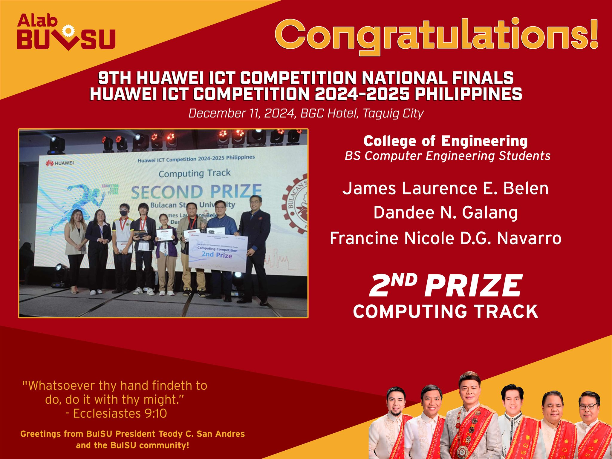
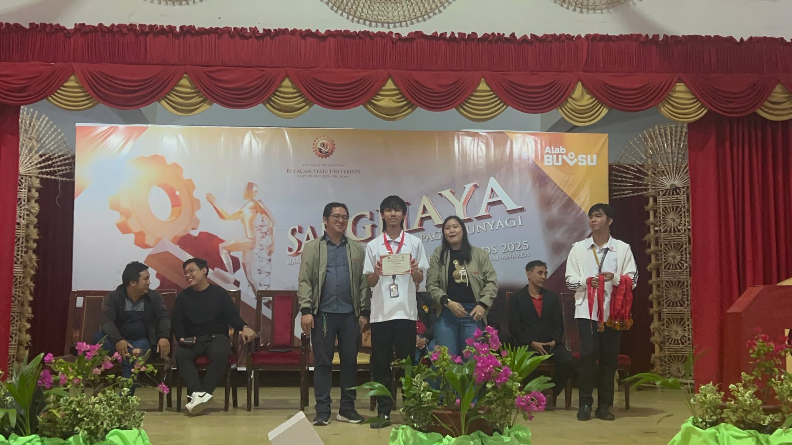
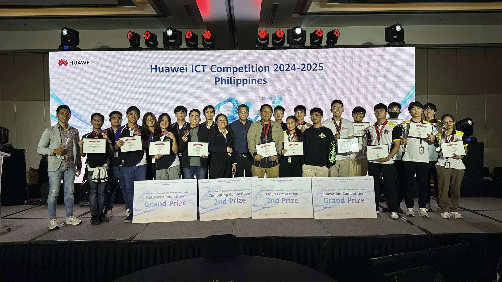
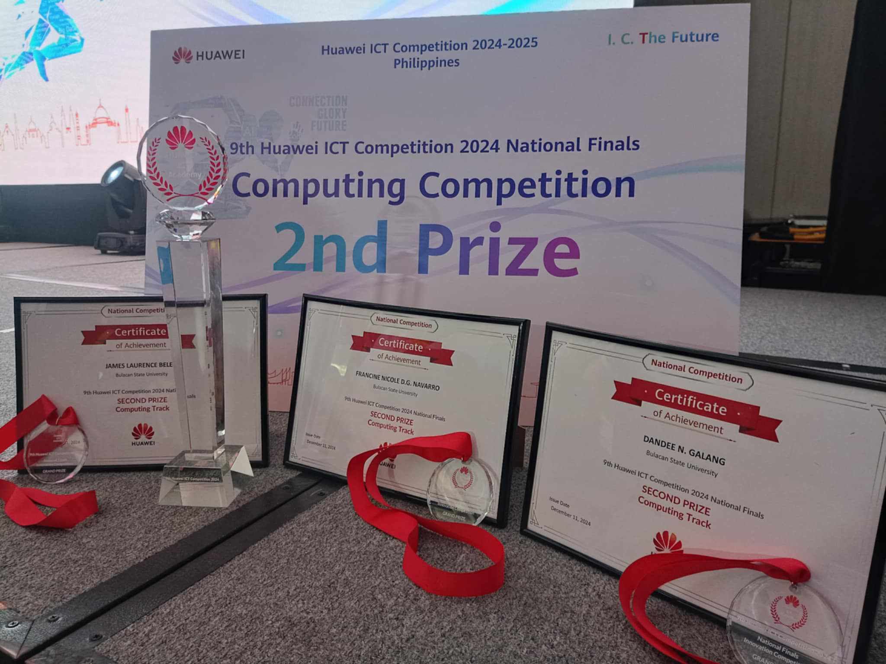
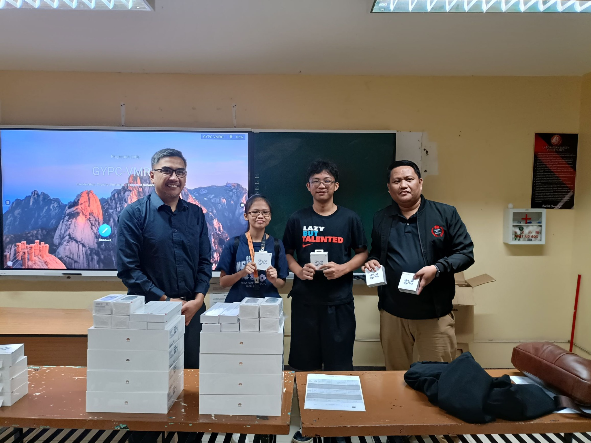
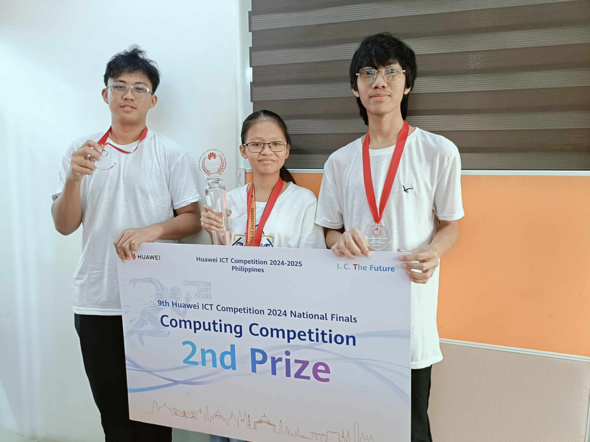
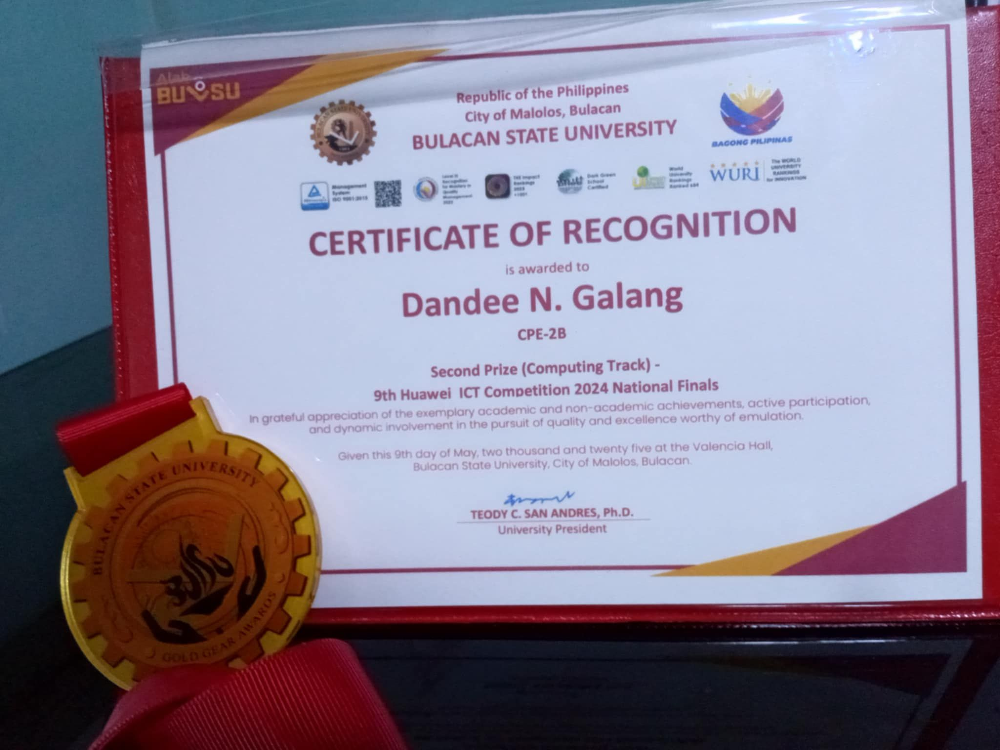
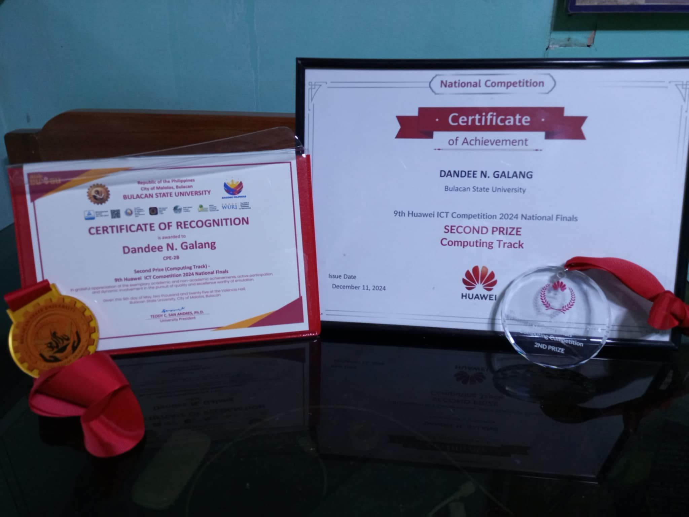

## 🏆 9th Huawei ICT Competition 2024-2025 National Finals

I am honored to have represented **Bulacan State University** at the **9th Huawei ICT Competition 2024-2025 National Finals**, held on **December 11, 2024**, at BGC Hotel, Taguig City. This prestigious event brought together the brightest student teams from across the country to showcase their mastery in networking, cloud, and computing technologies.

---

## 👥 Team & Coach

- **Team Members:** Francince Navarro, James Laurence Belen, and myself, Dandee Galang
- **Coach:** Engr. Alberto Cudia Cruz Jr.

---

## 🧠 Competition Experience

The competition was a true test of our technical skills and teamwork. We tackled challenging scenarios involving:

- **Linux System Administration** using Huawei’s OpenEuler OS
- **Database Management** with OpenGauss
- **Computer Architecture** and optimization on **Kunpeng processors**

We worked under pressure, solving real-world problems and demonstrating our ability to adapt and innovate using Huawei’s cutting-edge technologies. The experience deepened our understanding of enterprise-grade systems and gave us a glimpse into the future of open-source computing.

---

## 🌟 Highlights

- **Venue:** BGC Hotel, Taguig City
- **Date:** December 11, 2024
- **Technologies:** OpenEuler, OpenGauss, Kunpeng
- **Focus Areas:** Linux, Databases, Computer Architecture, Teamwork

---

## 🏅 University Recognition

After the competition, I was deeply honored to be recognized by my university, **Bulacan State University**. For our outstanding performance and representation at the national level, I was awarded the prestigious **Golden Gear Special Award**—a testament to the hard work, dedication, and excellence we strive for as BulSUans.

## 🙏 Gratitude

A huge thank you to my teammates, Francince and James, for their dedication and collaboration throughout our journey. Special thanks to our coach, **Engr. Alberto Cudia Cruz Jr.**, for his unwavering support, guidance, and belief in our abilities.

---

## 📸 Event Gallery

  
  
  
  
  
  

---

## 💡 Final Thoughts

Participating in the Huawei ICT Competition was an incredible learning experience. It pushed us to grow as engineers, work as a team, and apply our knowledge to real-world challenges. I am grateful for the opportunity and proud of what we accomplished together.

---

📚 References & Event Links

- [Huawei ICT Competition Official Site](https://e.huawei.com/en/talent/ict-competition)
- [OpenEuler](https://openeuler.org/en/)
- [OpenGauss](https://opengauss.org/en/)
- [Kunpeng Processors](https://e.huawei.com/en/products/servers/kunpeng)
- [Bulacan State University](https://bulsu.edu.ph/)

