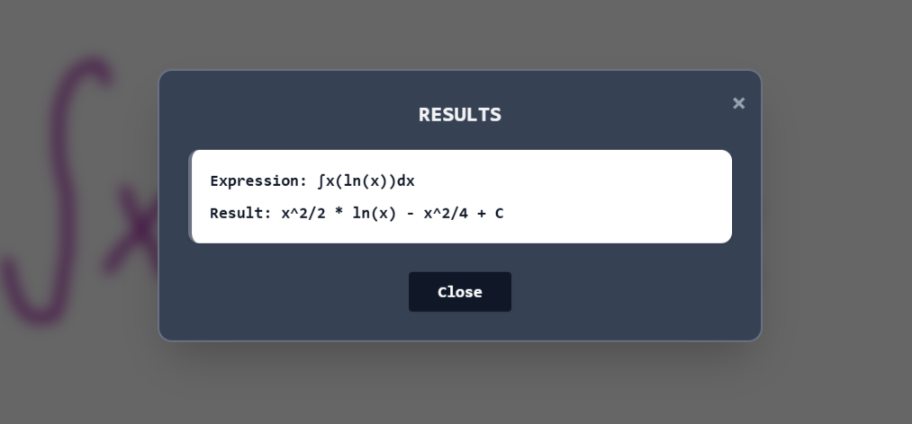
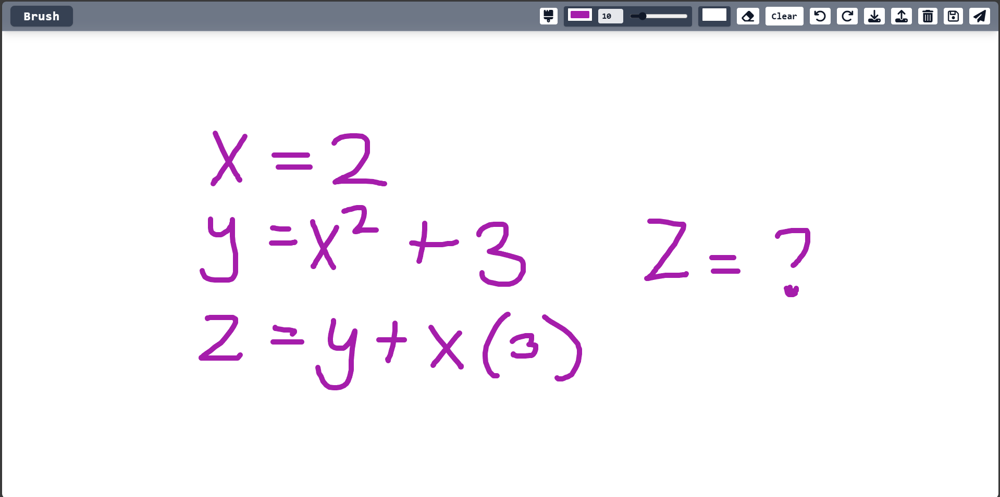
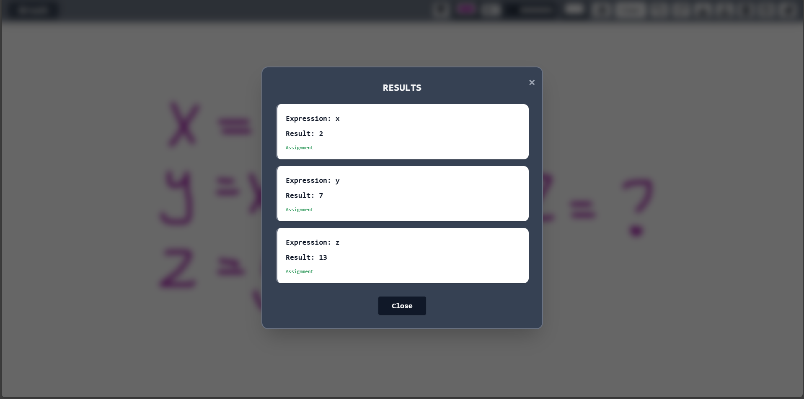
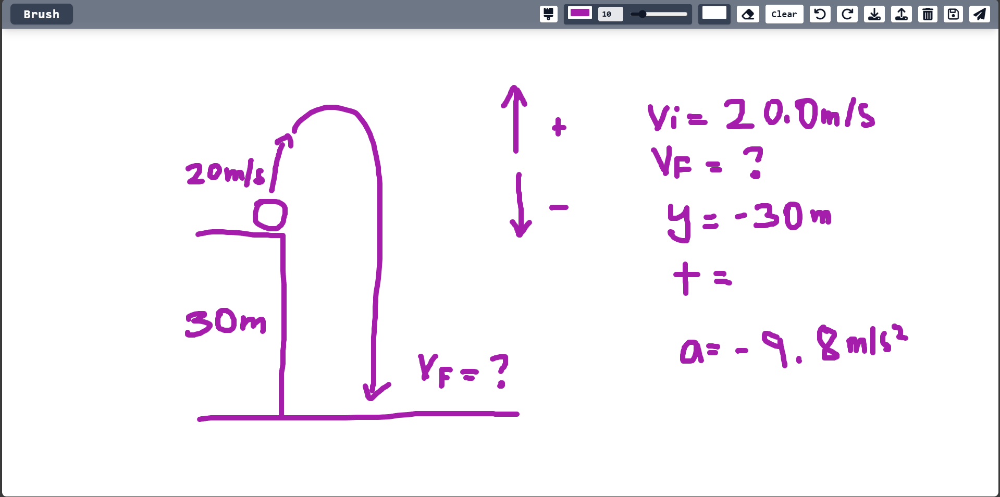
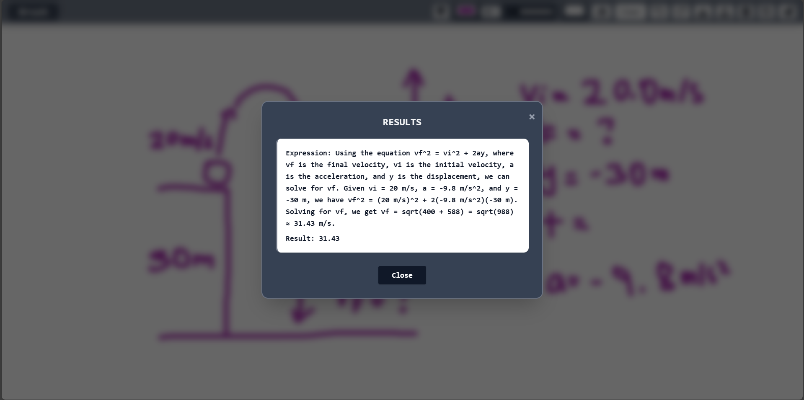

---

title: "AI Paint Calculator"
date: 2025-06-26
draft: false
description: "An intelligent paint app that solves handwritten math, geometry, and physics problems using AI."
categories: ["Projects"]
tags: ["Projects", "JavaScript", "React", "AI", "TailwindCSS", "Vite", "Gemini", "Canvas", "Python", "FastAPI"]
----------------------------------------------------------------------------------------------------------------

## 📝 Integration by Parts (Sample Problem):


> GitHub: [https://github.com/dandee77/AI-Paint-Calculator](https://github.com/dandee77/AI-Paint-Calculator)

---

## 🎨 Project Overview

**AI Paint Calculator** is a fully functional web app that lets users draw math, geometry, calculus, or physics problems directly on a digital canvas—and get **instant AI-powered answers**. Built using **ReactJS**, **TailwindCSS**, and a **Python FastAPI backend**, this app turns freehand problem-solving into an intuitive and creative experience.

This project showcases how **canvas-based drawing**, **FastAPI inference serving**, and **responsive frontend design** can come together into a powerful educational tool.

---

## ✨ Key Features

* 🖌️ **Brush & Eraser Tools**
* 🎛️ **Size & Color Selection**
* 🪣 **Background Color Fill**
* 🔄 **Undo / Redo Stack**
* 💾 **Save / Load from Local Storage**
* 🖼️ **Download Drawing as Image**
* 🤖 **Send to Gemini AI via Python FastAPI backend**
* 🧠 **Solves Math, Geometry, Calculus, Physics Problems**
* 📱 **Responsive Layout with Burger Menu for Small Screens**

---

## 📷 Screenshots

### Math Expression Recognition




### Physics Diagram Solving




---

## 🧠 What It Can Solve

* **Algebra & Arithmetic**: Variable assignment, equations, PEMDAS
* **Geometry**: Labeled diagrams, area, perimeter, angles
* **Calculus**: Derivatives, integrals, limits
* **Physics**: Force diagrams, motion, vectors

---

## 🛠️ Tech Stack

| Component      | Technology                 |
| -------------- | -------------------------- |
| Frontend       | React + Tailwind CSS       |
| Build Tool     | Vite                       |
| Backend        | Python (FastAPI)           |
| AI Integration | Google Gemini API          |
| Drawing Engine | HTML5 Canvas               |
| State Mgmt     | React Hooks + Refs         |
| Extra UI       | FontAwesome, Color Pickers |

---

## 🧩 File Structure

```bash
AI-Paint-Calculator/
├── api/
│   ├── main.py
│   ├── requirements.txt
├── public/
├── src/
│   ├── assets/
│   ├── components/
│   │   ├── TopBar.jsx
│   │   ├── CanvasArea.jsx
│   │   ├── ColorPickerPopover.jsx
│   │   └── Modal.jsx
│   └── App.jsx
├── index.html
├── package.json
└── tailwind.config.js
```

---

## 🚀 Getting Started

### 1. 🧠 Start the AI Backend (Python FastAPI)

Make sure you have Python 3.10+ installed. Then:

```bash
cd api
pip install -r requirements.txt
python main.py
```

This runs the FastAPI server on `http://localhost:8000`, using `uvicorn`.

> ⚠️ Keep the server running — the React frontend will communicate with it.

### 2. 🎨 Start the React App

Open a new terminal in the root project directory:

```bash
npm install
npm run dev
```

Then visit `http://localhost:5173` in your browser.

### 3. 🔧 Build for Production

```bash
npm run build
```

---

## 🔮 Future Enhancements

* ✍️ Improved handwriting recognition model
* 📱 Mobile-friendly drawing interactions
* 🧾 Math history & export to PDF
* 🌐 Language selection (multilingual)
* 🎓 Learning mode with hints and steps

---

## 💬 Final Thoughts

This project merges **art, AI, and education**—allowing anyone to interact with math in a fun and intuitive way. Whether it’s for students, teachers, or curious learners, the AI Paint Calculator is a demonstration of what’s possible with modern web technologies and AI integration.

<details>
<summary>📚 References & Tools Used</summary>
<div markdown="1">

* [Google Gemini API](https://deepmind.google/technologies/gemini/)
* [FastAPI Documentation](https://fastapi.tiangolo.com/)
* [ReactJS Docs](https://reactjs.org/)
* [Tailwind CSS Docs](https://tailwindcss.com/)
* [MDN Canvas Guide](https://developer.mozilla.org/en-US/docs/Web/API/Canvas_API)

</div>
</details>
