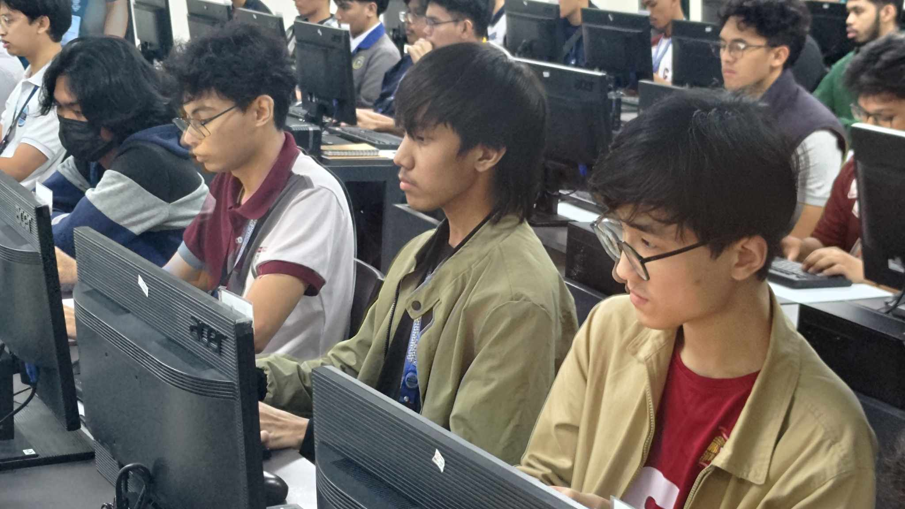

## 🏆 8th CpE Challenge 2025: NATIONALS CHAMPION!

I am beyond proud to announce that I am the **Champion** of the C++ programming competition at the **8th CpE Challenge 2025 ICpEP.se Nationals**! The event was held at **National University – Fairview** last **May 8–9, 2025**.

This national competition brought together the top Computer Engineering students from all over the Philippines, each representing their respective regions. The level of competition was intense, and it was an honor to stand among such talented and passionate individuals.

---

## 🏅 Event Highlights

- **Event:** 8th CpE Challenge 2025 – C++ Programming Nationals
- **Organizer:** Institute of Computer Engineers of the Philippines Student Edition (ICpEP.se)
- **Date:** May 8–9, 2025
- **Venue:** National University – Fairview
- **Achievement:** National Champion (C++)

---

## ✨ My Experience

The nationals were a true test of skill, speed, and composure. The problems were challenging, requiring not just technical knowledge but also creativity and perseverance. I spent countless hours preparing—solving advanced algorithmic problems, reviewing C++ intricacies, and simulating contest conditions.

During the competition, I focused on staying calm and thinking clearly under pressure. Each round was a battle of wits, and I gave my all to every problem. When my name was called as the national champion, it was a moment of pure joy and gratitude.

---

## 🌟 Special Thanks

This victory would not have been possible without the unwavering support and guidance of my exceptional coach, **Engr. Robert Justin S. Chavez**. Thank you, Sir, for leading the charge toward victory and for believing in me every step of the way!

I am also deeply grateful to my family, friends, and everyone who cheered me on throughout this journey.

---

## 📸 Event Gallery

  
  
  
  
  
  

*Winning moment of the National Champion’s award at National University – Fairview. (I still did not attend the awarding XD)*

---

## 💡 Final Thoughts

Winning the nationals is a dream come true and a testament to the power of hard work, resilience, and the support of a great mentor and community. I hope this achievement inspires others to pursue their passions and strive for excellence.

---

📚 References & Event Links

- [ICpEP.se Official Facebook Page](https://www.facebook.com/icpep.se)
- [National University – Fairview](https://national-u.edu.ph/nu-fairview/)

