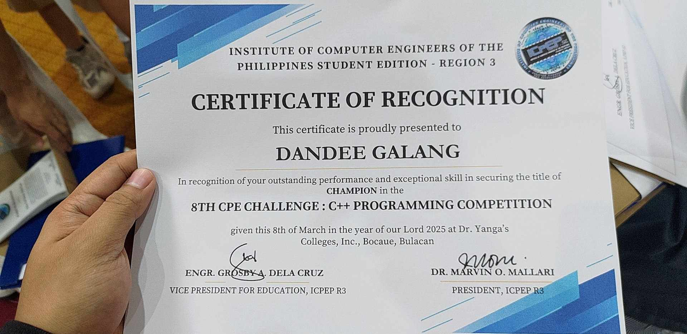
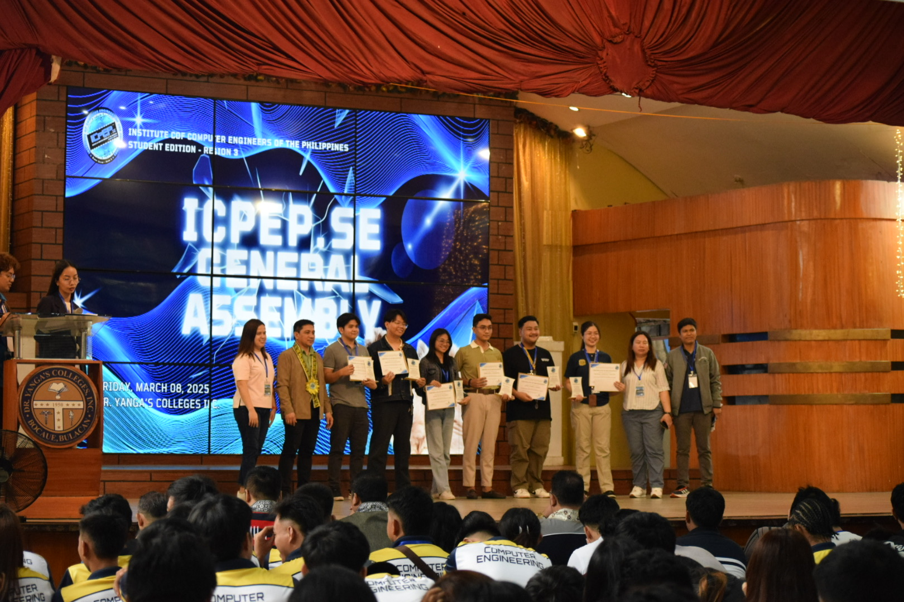

## 🏆 8th CpE Challenge 2025: Region III Champion!

I am thrilled to share that I emerged as the **Champion** in the C++ programming competition at the **8th CpE Challenge 2025**, organized by the Institute of Computer Engineers of the Philippines Student Edition (ICpEP.se) Region III! The event was held at **Dr. Yanga’s Colleges Inc.** last **March 7, 2025**.

This competition brought together the best and brightest Computer Engineering students from across Central Luzon, all vying for the top spot in C++ programming. The contest tested not only our technical skills but also our ability to solve problems under pressure and think creatively.

---

## 🏅 Event Highlights

- **Event:** 8th CpE Challenge 2025 – C++ Programming Competition
- **Organizer:** Institute of Computer Engineers of the Philippines Student Edition (ICpEP.se) Region III
- **Date:** March 7, 2025
- **Venue:** Dr. Yanga’s Colleges Inc.
- **Achievement:** Champion (Region III)

---

## ✨ My Experience

The competition was intense, with challenging problem sets that required a deep understanding of algorithms, data structures, and efficient coding practices. I dedicated weeks to preparing—reviewing advanced C++ concepts, practicing with past problems, and refining my problem-solving strategies.

On the day of the event, I focused on staying calm and methodical. Each round pushed my limits, but I managed to maintain my composure and deliver optimal solutions. Hearing my name announced as the champion was an unforgettable moment!

---

## 🌟 What’s Next?

As the Region III champion, I am honored to represent our region in the **National CpE Challenge**. I am excited for the opportunity to compete at the national level, meet fellow passionate programmers from across the country, and continue to grow as a Computer Engineer.

---

## 🙏 Acknowledgments

I would like to thank my mentors, teammates, and everyone who supported me throughout this journey. Special thanks to ICpEP.se Region III for organizing such a prestigious event and to Dr. Yanga’s Colleges Inc. for hosting.

---

## 📸 Event Gallery

  
  
  
  
  
  

*Receiving the Champion’s award at Dr. Yanga’s Colleges Inc. (A senior of mine takes the award for me since I was not able to attend the awarding)*

---

## 💡 Final Thoughts

Winning this competition is not just a personal achievement but also a testament to the power of perseverance, continuous learning, and the support of a great community. I look forward to representing Region III at the nationals and making everyone proud!

---

📚 References & Event Links

- [ICpEP.se R3 Official Facebook Page](https://www.facebook.com/ICpEP.seR3)
- [Dr. Yanga’s Colleges Inc.](https://www.dyc.edu.ph/)

