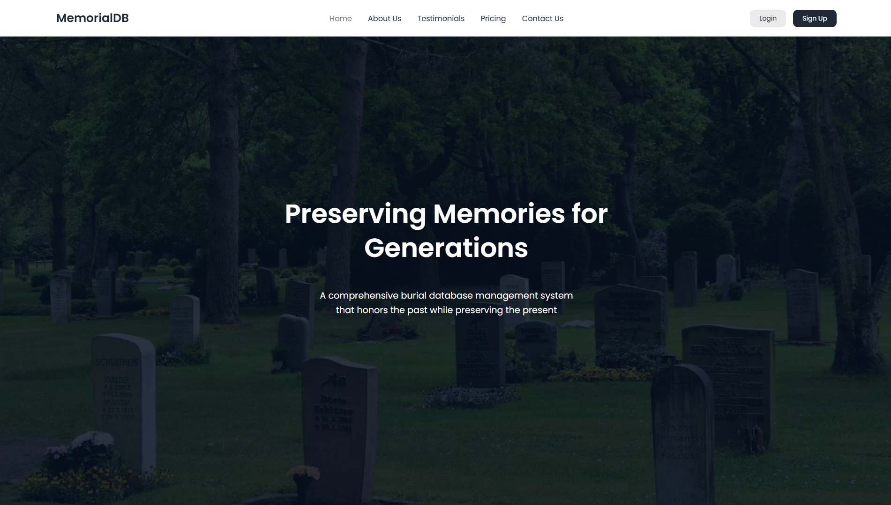
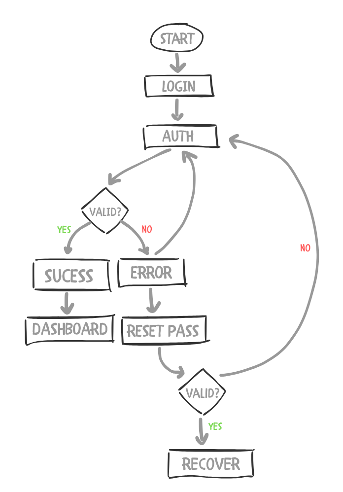
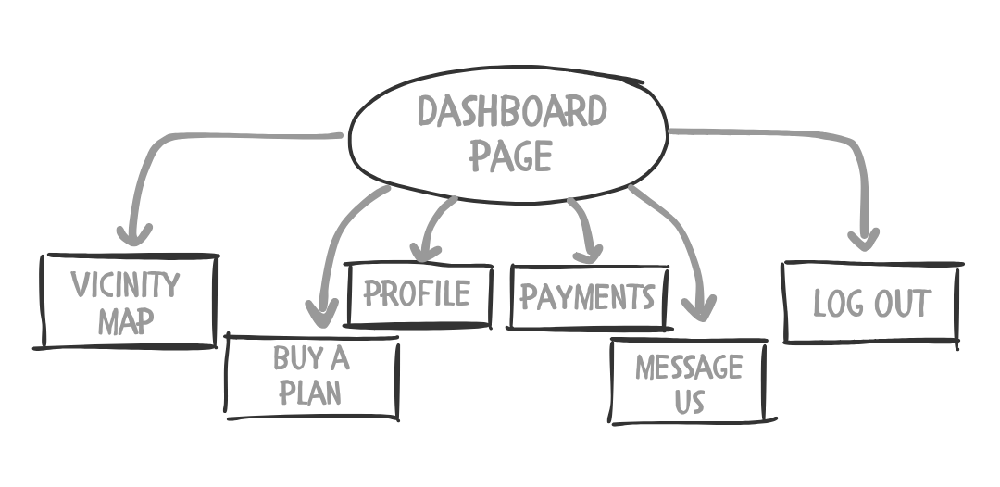

> GitHub: https://github.com/dandee77/Burial-DBMS.git
<br>
 Documentation: [MemorialDB_Documentation](assets/MemorialDB_%20A%20Cemetery%20Management%20System%20Website.pdf)

## 🚀 Project Overview

**BurialDB** is a web-based Cemetery Management System built to improve the efficiency, accuracy, and accessibility of cemetery services. Traditional cemetery operations often suffer from manual processes, which can result in delayed transactions, mismanaged records, and lack of client visibility. BurialDB addresses these issues by offering a user-friendly digital solution for both clients and administrators.

Clients can register, log in, and interact with their data through a personalized dashboard. Key features include plot browsing via an interactive vicinity map, real-time payment tracking, contract overview, and the ability to purchase slots or mausoleums directly from the interface. Administrators benefit from robust tools to monitor statistics, manage client information, oversee all contracts, and track overall revenue.

---

## 🧠 Core Features

### 🔐 Client Interface

<div style="text-align:center;">
    <video autoplay muted loop playsinline>
        <source src="assets/client.mp4" type="video/mp4">
        Your browser does not support the video tag.
    </video>
</div>

* Account registration and login
* Dashboard with notifications (e.g., pending or overdue payments)
* Interactive vicinity map to explore plots and mausoleums
* Slot purchasing with automatic cost computation
* Contract overview and monthly online payments
* Editable user profile

### 🛠️ Admin Interface

<div style="text-align:center;">
    <video autoplay muted loop playsinline>
        <source src="assets/admin.mp4" type="video/mp4">
        Your browser does not support the video tag.
    </video>
</div>

* System statistics and revenue dashboard
* Full access to client and contract records
* Plot and mausoleum information management
* Performance tracking with graphs and insights


---

## 🛠️ Tech Stack

| Component        | Technology              |
| ---------------- | ----------------------- |
| Backend          | Python (FastAPI)        |
| Database         | SQLite                  |
| Frontend         | HTML, CSS, JavaScript   |
| API Architecture | REST API                |
| Deployment       | Uvicorn + Ngrok         |

---

## 🖼️ Key Pages & Functionality

### Client Side:

* **Landing Page** – Introductory page showcasing the service
* **Dashboard** – Notifications and financial overview
* **Vicinity Map** – Interactive visualization of the entire cemetery layout
* **Buy A Plan** – Slot purchasing page with detailed cost computation
* **Payments** – Contract list with status and payment options
* **Profile** – Update personal information

### Admin Side:

* **Statistics Dashboard** – Graphs and summaries of revenue and system activity
* **Clients Page** – Complete list of client data and actions
* **Contracts Page** – Overview of all contract information and statuses

---

  
## 🧩 System Architecture Overview


> Figure 1: Landing Page Flowchart

MemorialDB, we 
followed a practical and straightforward 
development process using a mix of front-end 
and back-end technologies. We designed the 
user interface with HTML, CSS, and JavaScript 
to make sure the website looked clean, was easy 
to navigate, and worked well on different 
devices. 
On the back-end, we used Python with 
FastAPI to handle the logic behind the scenes. 
FastAPI allowed us to create a fast and secure 
connection between the website and the 
database. For storing data like burial records and 
plot information, we chose SQLite—a simple, 
lightweight database that was easy to set up and 
worked well for our project’s needs. 
To make the system accessible online 
while we were developing and testing it, we 
used Ngrok. This tool gave us a public URL that 
linked to our local server, making it easy to test 
the website from different devices or share it 
with others for feedback. 


> Figure 2: Dashboard Flowchart

The system follows a **client-server model** using FastAPI for backend logic and RESTful APIs for communication. The database schema includes models for clients, slots, deceased individuals, contracts, and payments. Authentication is temporarily managed with session variables and will transition to JWT for improved security in the future.

User actions on the frontend (e.g., buying a slot or viewing payments) send requests to the API, which processes the logic and interacts with the SQLite database. Responses are then rendered back into the UI dynamically.

---

## 📦 Folder Structure

```bash
BurialDB/
├── static/
│   ├── assets/
│   ├── styels.css
│   └── script.js
├── template/
│   ├── index.html
│   └── dashboard/
├── main.py
├── models.py
├── database.py
├── seed_data.py
├── requirements.txt
└── README.md
```

---

## 🔧 Setup & Deployment

To run the system locally:

```bash
git clone https://github.com/dandee77/Burial-DBMS.git
cd Burial-DBMS
pip install -r requirements.txt
python main.py
```

Then open the frontend HTML files in your browser (serve with Live Server or similar tools).
> ⚠️ If it is not working, then see the repository for more info [MemorialDB-github](https://github.com/dandee77/Burial-DBMS.git)

---

## 🌱 Future Improvements

* Secure authentication using JWT tokens
* Mobile responsiveness
* Admin editing for deceased records and slots
* Integration with digital payment gateways
* Search and filter system for maps and contracts

---

## ✨ Final Thoughts

BurialDB modernizes an overlooked sector by bringing digital efficiency to cemetery operations. Through automation, real-time access, and user-focused design, this project shows how even traditional industries can benefit from thoughtful tech innovation.

<details>
<summary>📚 References & Tools Used</summary>
<div markdown="1">

* [FastAPI Documentation](https://fastapi.tiangolo.com/)
* [SQLite Documentation](https://sqlite.org/docs.html)
* [MDN Web Docs](https://developer.mozilla.org/)

</div>
</details>


