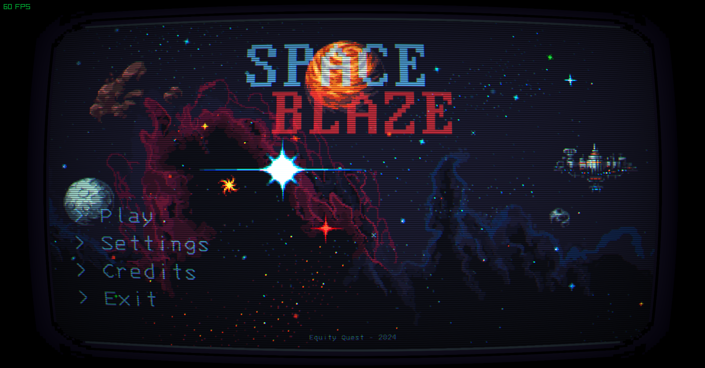
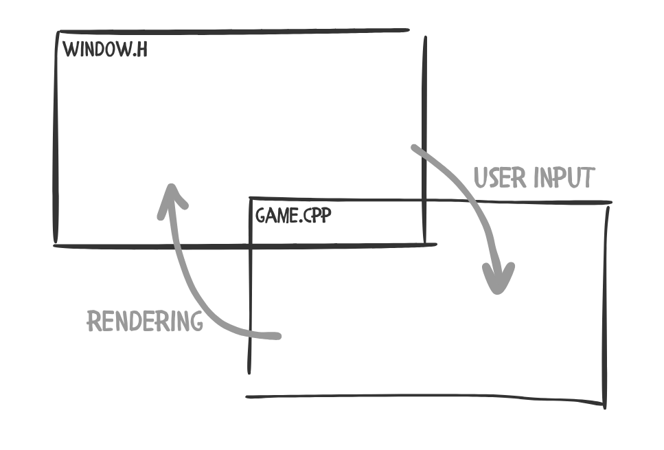
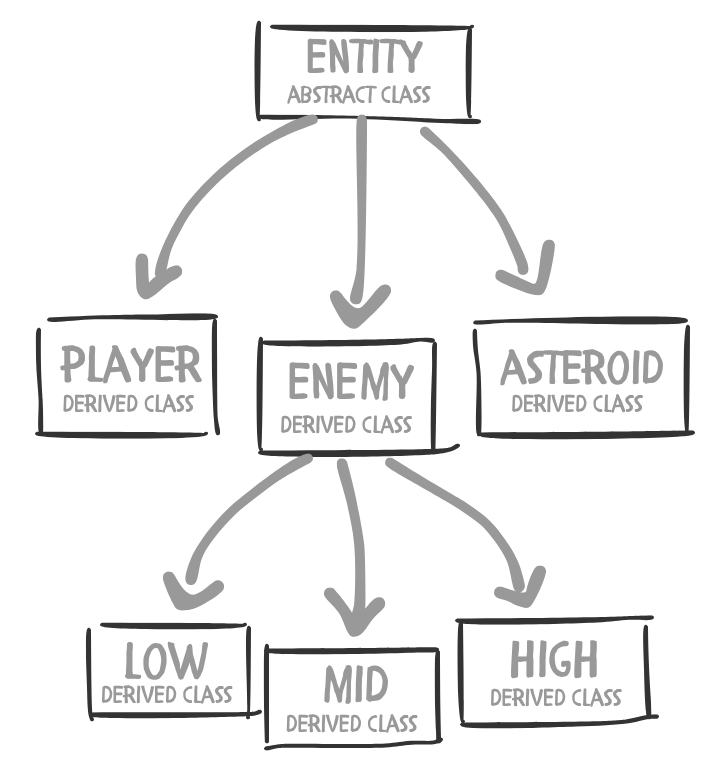

<!-- width="550" -->
<div style="text-align:center;">
    <video autoplay muted loop playsinline>
        <source src="image/0.mp4" type="video/mp4">
        Your browser does not support the video tag.
    </video>
</div>
<br>

> Github: https://github.com/dandee77/space-ablaze.git
<br>
 Itch.io: https://dandee77.itch.io/space-ablaze

Experience the blast from the past and dive into the world of retro with **SPACE ABLAZE**, where you will experience the thrill of a classic arcade. Space Ablaze is a survival and top-down shooter that uses simple joystick-like controls. 

The game is set in the vastness of space, where you’ll face a relentless swarm of enemy battleships that grow more formidable with each passing moment. With a diverse array of enemies featuring unique attack patterns, you’ll need to stay on your toes.

## 🚀 Project Overview

**Space Ablaze** is a 2D top-down survival shooter game developed using **C++** and the **Raylib** graphics library. The game throws the player into a hostile space environment swarming with alien ships. The objective is simple: survive as long as possible while taking down waves of enemies. With retro arcade aesthetics, responsive controls, and adrenaline-fueled action, Space Ablaze delivers a bite-sized but addictive gameplay experience.



<br>

## 🎮 Gameplay Features

* **Survival Mode:** Endless waves of enemies with increasing difficulty.
* **Simple Controls:** Movement via `mouse cursor`, shooting with `left mouse button` or `E keyboard button` to auto-shoot.
* **Powerups:** Temporary boosts like shield, rapid fire, and health drops (Coming Soon).
* **Explosions and Effects:** Particle effects and screen shakes to enhance immersion.

<br>

## 🛠️ Tech Stack

| Component        | Technology              |
| ---------------- | ----------------------- |
| Language         | C++                     |
| Graphics Library | Raylib                  |
| Assets           | Game assets from itch.io|
| Build Tool       | CMake / g++             |
| Platform         | Desktop (Windows/Linux) |

## 🧠 Design Considerations

* **Entity Component System (ECS)-like structure:** Lightweight object-based system to separate logic.
* **Game loop efficiency:** Fixed timestep updates and decoupled rendering.
* **Asset Management:** Texture caching and centralized loading to prevent redundant memory usage.
* **Memory efficiency:** Utilizes the RAII programming technique for fast and quick memory I/O.     
* **Optimization:** Uses various data structures and the C++ STL for better perfomance.  

<br>

## 🖼️ Game Architecture Diagram

* **Game Window and Rendering Architecture**
<div style="text-align:center;">
    
</div>
The game window is initialized and managed through the Application class, defined in application.hpp. This class is responsible for setting up the core application lifecycle, including window creation, event handling, and the main game loop. It abstracts away platform-specific windowing logic to provide a clean and centralized entry point for the game runtime.

Rendering responsibilities are decoupled from the application logic and handled separately in game.cpp. This separation of concerns promotes a modular design, where the renderer is focused solely on drawing game objects, managing visual assets, and updating frames based on game state.

By abstracting rendering logic into game.cpp, the system achieves better maintainability and scalability. The Application class delegates rendering tasks to the renderer, allowing high-level logic (such as state management and timing) to remain isolated from low-level graphics operations.

This architecture adheres to the principles of abstraction and separation of concerns, enabling clear boundaries between the windowing system and rendering pipeline. It also facilitates easier debugging, testing, and future extensions to either system independently.
<br>

* **The Entity Class**
<div style="text-align:center;">
    
</div>
All entities in the system inherit from the abstract base class Entity. For example, the Player class represents the player character, while the Asteroid and Enemy classes represent other game objects. The Enemy class serves as a base for specialized enemy types, including LowLevelEnemy, MidLevelEnemy, and HighLevelEnemy.

To ensure cleaner and more efficient implementation, all enemy instances are managed within a single container using a hash map. This design leverages polymorphism and abstraction to provide a robust and scalable entity architecture.

All entity containers utilize `std::shared_ptr` to ensure proper memory management. Additionally, textures and animations used by the entities are referenced rather than duplicated, minimizing memory overhead and improving performance.
<br>


## 📦 Folder Structure

```bash
SpaceAblaze/
├── src/
│   ├── main.cpp
│   ├── player.cpp/.h
│   ├── enemy.cpp/.h
│   ├── bullet.cpp/.h
├── assets/
│   ├── sprites/
│   └── sounds/
├── build/
├── CMakeLists.txt
└── README.md
```
The SpaceAblaze project is organized to maintain clarity, modularity, and ease of scalability. At its core, the src/ directory contains the game's source code, including the main entry point (main.cpp) and the implementation of key gameplay components such as the player, enemies, and bullets, each split into their respective .cpp and .h files to maintain separation of interface and implementation.

Game assets are stored under the assets/ directory, with subfolders for sprites/ and sounds/, allowing for clean management of visual and audio resources. The build/ directory serves as the target for compiled binaries and intermediate files, keeping the working directory clean and focused. Project configuration is handled through CMakeLists.txt, supporting portable and scalable builds across systems. Additionally, the root-level README.md provides documentation and guidance for understanding, building, and running the project.

This structure enforces a clear separation between code, assets, and build outputs, aligning with best practices for game development and making the codebase more maintainable and collaboration-friendly.

<br>

## 🔧 Build & Run

This project is organized for you to run the game from source without any hassle.
Just this paste in your terminal:
```bash
build
```
> ⚠️ If it is not working, then see the repository for more info [SpaceAblaze-github](https://github.com/dandee77/space-ablaze.git)

<br>

## 🌟 Future Improvements

* Add boss levels every N waves
* Soundtrack and dynamic background music
* Score saving and leaderboard
* Gamepad support
* Steam deployment

<br>

## ✨ Final Thoughts

This project was built from scratch as a personal challenge to explore lower-level game dev with C++ and get hands-on with Raylib. It’s a compact yet complete game that showcases core game development concepts—game loops, input handling, collision detection, resource management, and user feedback.

<br>

<details>
<summary>📚 References & Tools Used</summary>
<div markdown="1">

* [Raylib Documentation](https://www.raylib.com/cheatsheet/cheatsheet.html)
* [Game Assets](https://foozlecc.itch.io)
* [CMake Official Docs](https://cmake.org/cmake/help/latest/)

</div>
</details>


